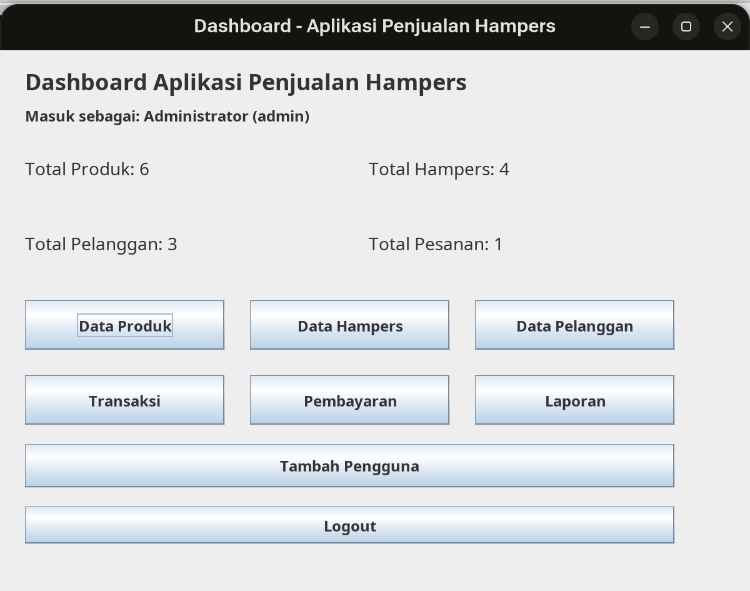
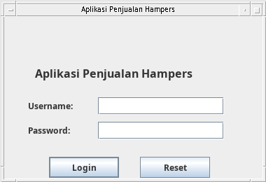
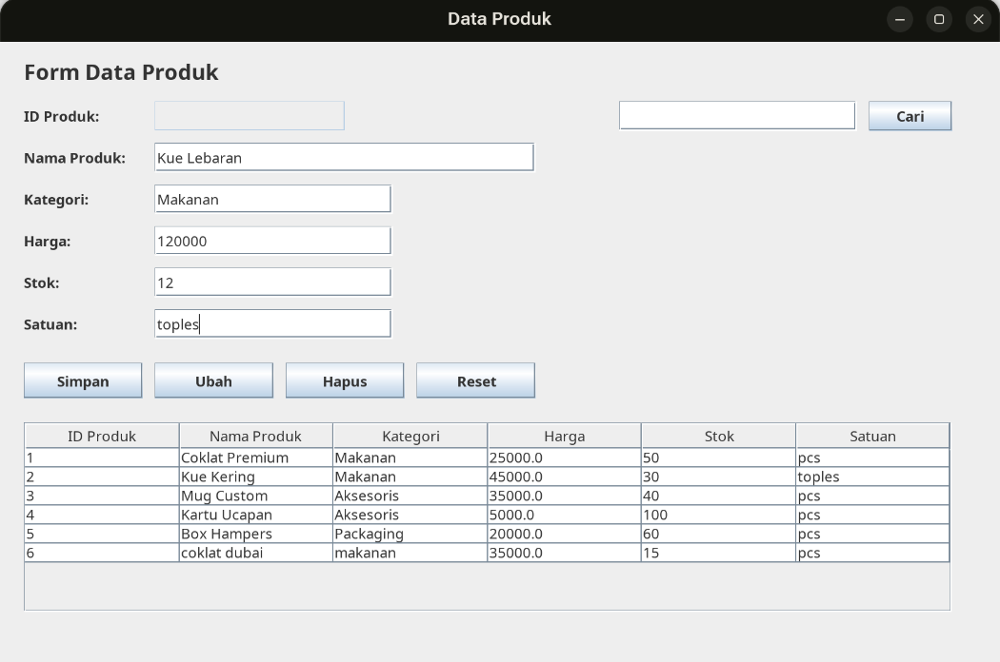
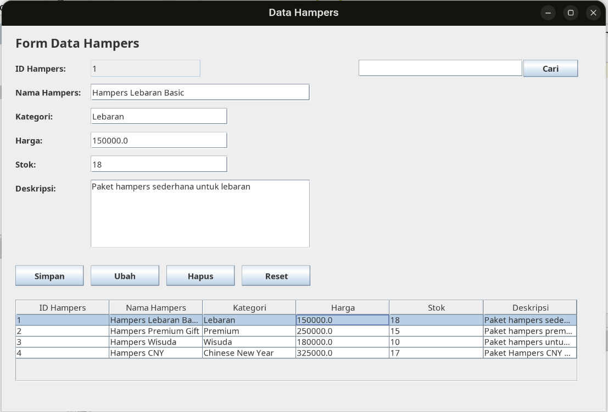
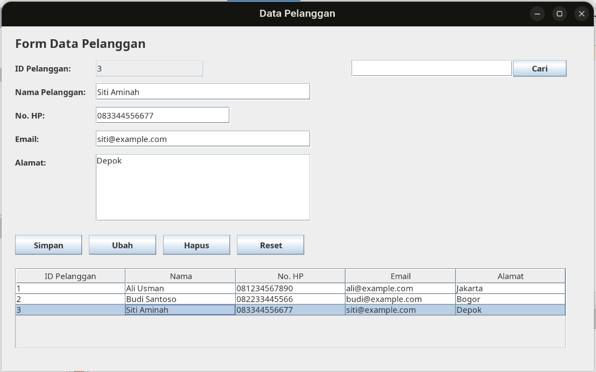
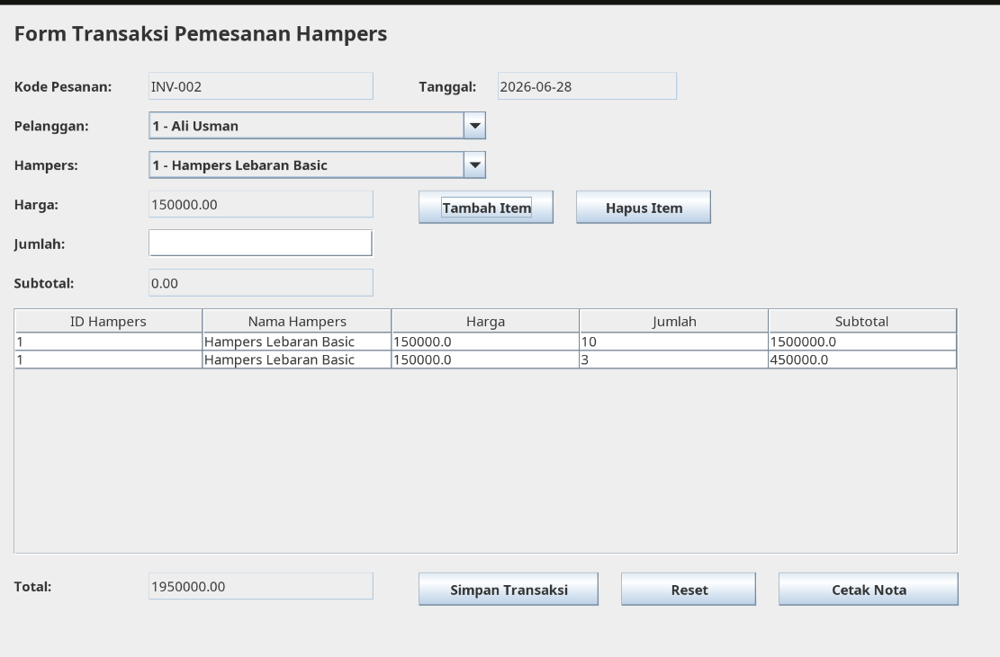
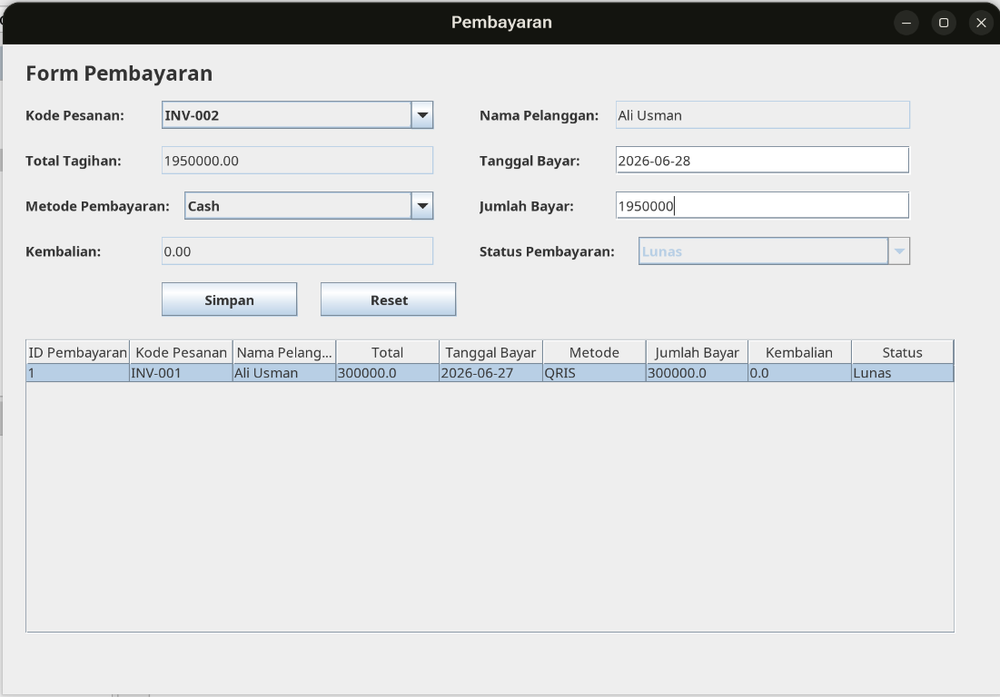
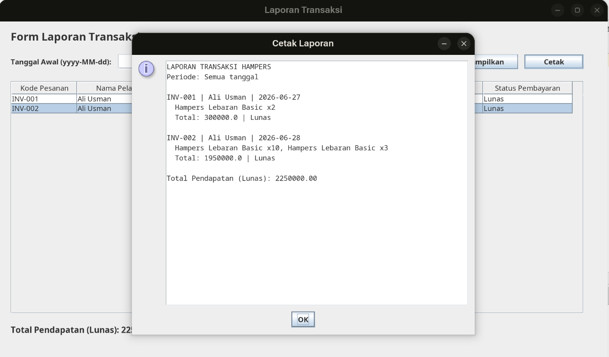
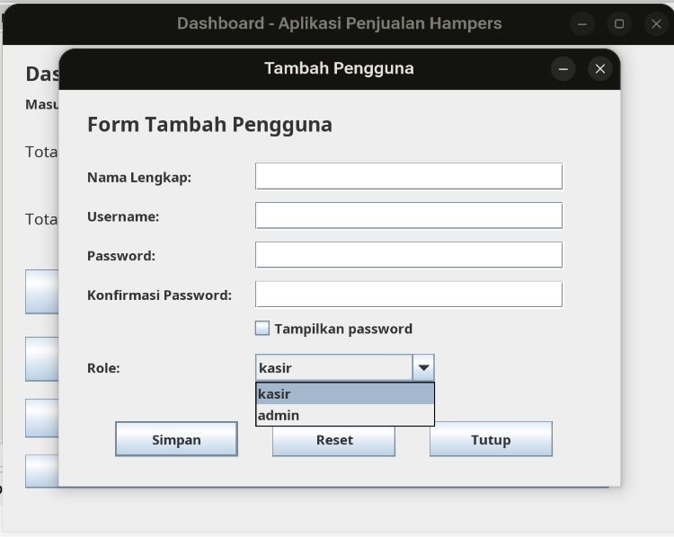

# Aplikasi Penjualan Hampers

Aplikasi desktop berbasis Java Swing untuk mengelola penjualan hampers, mulai
dari data master, pemesanan, pembayaran, sampai laporan transaksi. Data aplikasi
disimpan di MySQL/MariaDB melalui JDBC.



## Daftar isi

- [Fitur utama](#fitur-utama)
- [Hak akses pengguna](#hak-akses-pengguna)
- [Teknologi](#teknologi)
- [Persyaratan sistem](#persyaratan-sistem)
- [Instalasi dan konfigurasi](#instalasi-dan-konfigurasi)
- [Cara menggunakan aplikasi](#cara-menggunakan-aplikasi)
- [Struktur database](#struktur-database)
- [Struktur proyek](#struktur-proyek)
- [Tampilan aplikasi](#tampilan-aplikasi)
- [Keamanan password](#keamanan-password)
- [Troubleshooting](#troubleshooting)

## Fitur utama

- **Login pengguna** dengan akun yang tersimpan di database.
- **Dashboard ringkasan** yang menampilkan jumlah produk, hampers, pelanggan,
  dan pesanan.
- **Data produk** untuk menambah, mengubah, menghapus, mencari, dan menampilkan
  produk beserta kategori, harga, stok, dan satuannya.
- **Data hampers** untuk mengelola nama hampers, kategori, harga, stok, dan
  deskripsi.
- **Data pelanggan** untuk mengelola nama, nomor HP, email, dan alamat pelanggan.
- **Transaksi pemesanan** dengan kode invoice otomatis, beberapa item dalam satu
  pesanan, perhitungan subtotal dan total, pemeriksaan stok, serta cetak nota.
- **Pembayaran** dengan metode Cash, Transfer Bank, QRIS, atau E-Wallet. Status
  pembayaran ditentukan menjadi `Belum Lunas`, `DP`, atau `Lunas` berdasarkan
  jumlah yang dibayar.
- **Laporan transaksi** untuk semua tanggal atau rentang tanggal tertentu,
  lengkap dengan detail hampers, status pembayaran terakhir, total pendapatan
  lunas, dan tampilan cetak.
- **Manajemen pengguna** untuk membuat akun kasir atau admin baru.

## Hak akses pengguna

| Menu | Admin | Kasir |
| --- | :---: | :---: |
| Dashboard dan data master | Ya | Ya |
| Transaksi, pembayaran, dan laporan | Ya | Ya |
| Tambah pengguna | Ya | Tidak |
| Logout | Ya | Ya |

Tombol **Tambah Pengguna** hanya ditampilkan ketika akun yang masuk memiliki
role `admin`.

## Teknologi

| Komponen | Keterangan |
| --- | --- |
| Bahasa | Java 22 |
| Antarmuka | Java Swing |
| Database | MySQL/MariaDB |
| Akses database | JDBC dan MySQL Connector/J |
| Build system | Apache Ant melalui NetBeans |
| IDE | Apache NetBeans |
| Keamanan password | PBKDF2-HMAC-SHA256 |

## Persyaratan sistem

Siapkan perangkat berikut sebelum membuka proyek:

- JDK 22 sesuai konfigurasi proyek;
- Apache NetBeans;
- MySQL atau MariaDB, misalnya dari XAMPP;
- MySQL Connector/J;
- Git, jika proyek diambil dari repository.

Apache pada XAMPP tidak diperlukan karena aplikasi hanya memakai layanan
database MySQL.

## Instalasi dan konfigurasi

### 1. Ambil dan buka proyek

Jika menggunakan Git:

```bash
git clone <url-repository>
cd Hampers_Uas
```

Di NetBeans, pilih **File > Open Project**, pilih folder `Hampers_Uas`, lalu
klik **Open Project**. Pastikan Java Platform proyek menggunakan JDK 22.

### 2. Siapkan database

Nyalakan MySQL/MariaDB, kemudian impor [`db_hampers.sql`](db_hampers.sql).
File SQL tersebut akan:

1. membuat database `db_hampers` jika belum ada;
2. membuat seluruh tabel dan relasinya;
3. membuat atau memperbarui akun administrator awal.

Impor melalui phpMyAdmin dengan memilih tab **Import**, atau melalui terminal:

```bash
mysql -u root -p < db_hampers.sql
```

### 3. Atur koneksi database

Konfigurasi yang dipakai aplikasi utama berada di
[`src/apphampers/Koneksi.java`](src/apphampers/Koneksi.java):

```java
private static final String URL = "jdbc:mysql://localhost:3306/db_hampers";
private static final String USER = "root";
private static final String PASSWORD = "root";
```

Konfigurasi bawaan repository menggunakan username MySQL `root` dan password
MySQL `root`. Sesuaikan `USER` dan `PASSWORD` dengan akun database di komputer
Anda. Contohnya, jika akun `root` tidak memiliki password, ubah nilainya menjadi
string kosong (`""`).

> Password database berbeda dari password login aplikasi.

### 4. Tambahkan MySQL Connector/J

Proyek memiliki referensi Connector/J dari komputer pengembang. Pada komputer
lain, lokasi tersebut kemungkinan tidak tersedia sehingga JAR perlu ditambahkan
ulang:

1. unduh dan ekstrak MySQL Connector/J yang kompatibel;
2. klik kanan proyek di NetBeans, lalu buka **Properties > Libraries**;
3. pada tab **Compile**, pilih **Add JAR/Folder**;
4. pilih file JAR Connector/J dan simpan perubahan.

Connector/J harus tersedia saat aplikasi dijalankan walaupun source code dapat
dikompilasi memakai API `java.sql` bawaan Java.

### 5. Build dan jalankan

1. Pilih **Run > Clean and Build Project**.
2. Klik **Run Project** atau tekan `F6`.
3. Main class proyek sudah dikonfigurasi ke `apphampers.Main`.
4. Masuk menggunakan akun awal berikut.

| Field | Nilai |
| --- | --- |
| Username aplikasi | `admin` |
| Password aplikasi | `admin123` |
| Role | `admin` |

## Cara menggunakan aplikasi

Alur penggunaan yang disarankan:

1. Masuk melalui form login.
2. Isi **Data Produk**, **Data Hampers**, dan **Data Pelanggan**.
3. Buka menu **Transaksi**, pilih pelanggan, lalu tambahkan satu atau beberapa
   hampers ke daftar transaksi.
4. Pastikan jumlah tidak melebihi stok, kemudian simpan transaksi. Penyimpanan
   transaksi dan pengurangan stok dilakukan dalam satu transaksi database agar
   data tetap konsisten.
5. Buka menu **Pembayaran**, pilih kode pesanan, metode pembayaran, dan masukkan
   jumlah bayar.
6. Buka menu **Laporan** untuk melihat transaksi dan total pendapatan yang sudah
   berstatus lunas. Isi kedua tanggal dalam format `yyyy-MM-dd` jika ingin
   memfilter periode.

Kode pesanan dibuat otomatis dalam format `INV-001`, `INV-002`, dan seterusnya.

## Struktur database

| Tabel | Fungsi |
| --- | --- |
| `users` | Akun login, nama lengkap, hash password, dan role pengguna |
| `produk` | Data master produk, harga, stok, dan satuan |
| `hampers` | Data hampers yang dapat dimasukkan ke transaksi |
| `pelanggan` | Identitas dan kontak pelanggan |
| `pesanan` | Header transaksi dan total pesanan |
| `detail_pesanan` | Daftar hampers, harga, jumlah, dan subtotal per pesanan |
| `pembayaran` | Riwayat pembayaran dan status pembayaran pesanan |

Relasi utamanya adalah:

```text
pelanggan 1 --- n pesanan 1 --- n detail_pesanan n --- 1 hampers
                       |
                       +--- n pembayaran
```

Foreign key memakai InnoDB. Penghapusan pesanan akan menghapus detail dan
pembayarannya, sedangkan data pelanggan atau hampers yang masih digunakan oleh
pesanan tidak dapat dihapus begitu saja.

## Struktur proyek

```text
Hampers_Uas/
├── assets/                  # Screenshot tampilan aplikasi
├── nbproject/               # Konfigurasi proyek NetBeans
├── src/
│   └── apphampers/
│       ├── Main.java        # Entry point aplikasi
│       ├── Koneksi.java     # Konfigurasi koneksi JDBC
│       ├── FormLogin.java
│       ├── FormDashboard.java
│       ├── FormProduk.java
│       ├── FormHampers.java
│       ├── FormPelanggan.java
│       ├── FormTransaksi.java
│       ├── FormPembayaran.java
│       ├── FormLaporan.java
│       ├── FormPengguna.java
│       └── PasswordHasher.java
├── build.xml                # Script build Ant/NetBeans
├── db_hampers.sql           # Skema database dan akun awal
└── README.md
```

Package `apphampers` adalah implementasi utama yang dijalankan oleh
`apphampers.Main`.

## Tampilan aplikasi

Seluruh screenshot aplikasi disimpan di folder [`assets`](assets).

<table>
  <tr>
    <td width="50%"><strong>Login</strong><br></td>
    <td width="50%"><strong>Dashboard</strong><br></td>
  </tr>
  <tr>
    <td width="50%"><strong>Data Produk</strong><br></td>
    <td width="50%"><strong>Data Hampers</strong><br></td>
  </tr>
  <tr>
    <td width="50%"><strong>Data Pelanggan</strong><br></td>
    <td width="50%"><strong>Transaksi Hampers</strong><br></td>
  </tr>
  <tr>
    <td width="50%"><strong>Pembayaran</strong><br></td>
    <td width="50%"><strong>Laporan Transaksi</strong><br></td>
  </tr>
  <tr>
    <td width="50%"><strong>Tambah Pengguna</strong><br></td>
    <td width="50%"></td>
  </tr>
</table>

## Keamanan password

- Password pengguna baru minimal 8 karakter.
- Password disimpan sebagai hash PBKDF2-HMAC-SHA256 dengan salt acak, 210.000
  iterasi, dan panjang key 256 bit.
- Password polos tidak disimpan oleh form tambah pengguna.
- Jika aplikasi menemukan password polos dari database versi lama saat login,
  password tersebut otomatis dimigrasikan menjadi hash setelah login berhasil.
- Username harus unik dan hanya boleh berisi huruf, angka, titik, garis bawah,
  atau tanda minus.

## Troubleshooting

### `No suitable driver found`

MySQL Connector/J belum masuk ke classpath. Tambahkan ulang file JAR melalui
**Project Properties > Libraries**, lalu lakukan **Clean and Build**.

### `Access denied for user 'root'@'localhost'`

Username atau password MySQL pada `src/apphampers/Koneksi.java` tidak cocok
dengan konfigurasi server. Perbarui nilai `USER` dan `PASSWORD`.

### `Unknown database 'db_hampers'` atau tabel tidak ditemukan

Impor ulang `db_hampers.sql` dan pastikan aplikasi terhubung ke port serta nama
database yang benar.

### Menu Tambah Pengguna tidak terlihat

Menu tersebut hanya tersedia untuk akun dengan role `admin`. Akun dengan role
`kasir` tetap dapat mengakses menu operasional lainnya.

### Filter laporan tidak dapat ditampilkan

Tanggal awal dan akhir wajib diisi bersama-sama menggunakan format
`yyyy-MM-dd`, dan tanggal awal tidak boleh melewati tanggal akhir.
